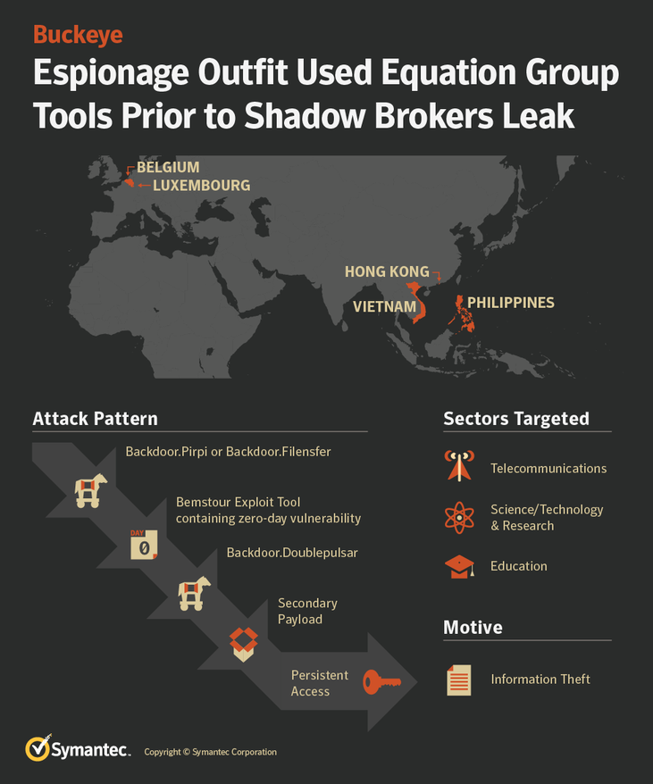

Chinese intelligence agents acquired National Security Agency hacking tools and repurposed them in 2016 to [attack American allies and private companies in Europe and Asia](https://www.infosecusa.com/chinese-spies-took-the-nsa-hacking-tools) , a leading cybersecurity firm has discovered. The episode is the latest evidence that the United States has lost control of key parts of its cybersecurity arsenal.  

According to the report by Symantec and others:

*Based on the timing of the attacks and clues in the computer code, researchers with the firm Symantec believe the Chinese did not steal the code but captured it from an N.S.A. attack on their own computers -- like a gunslinger who grabs an enemy's rifle and starts blasting away. The Chinese action shows how proliferating cyberconflict is creating a digital wild West with few rules or certainties, and how difficult it is for the United States to keep track of the malware it uses to break into foreign networks and attack adversaries' infrastructure.*

*The losses have touched off a debate within the intelligence community over whether the United States should continue to develop some of the world's most high-tech, stealthy cyberweapons if it is unable to keep them under lock and key. The Chinese hacking group that co-opted the N.S.A.'s tools is considered by the agency's analysts to be among the most dangerous Chinese contractors it tracks, according to a classified agency memo reviewed by The  *New York Times* . The group is responsible for numerous attacks on some of the most sensitive defense targets inside the United States, including space, satellite and nuclear propulsion technology makers. Now, Symantec's discovery, unveiled on Monday, suggests that the same Chinese hackers the agency has trailed for more than a decade have turned the tables on the agency.*